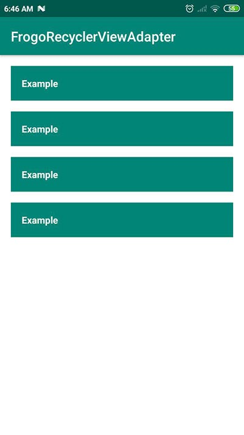
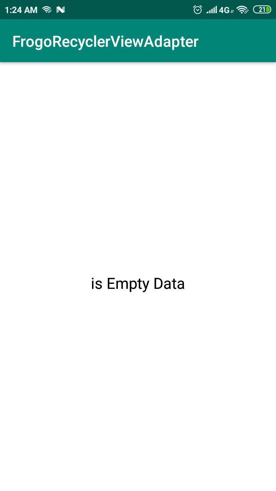
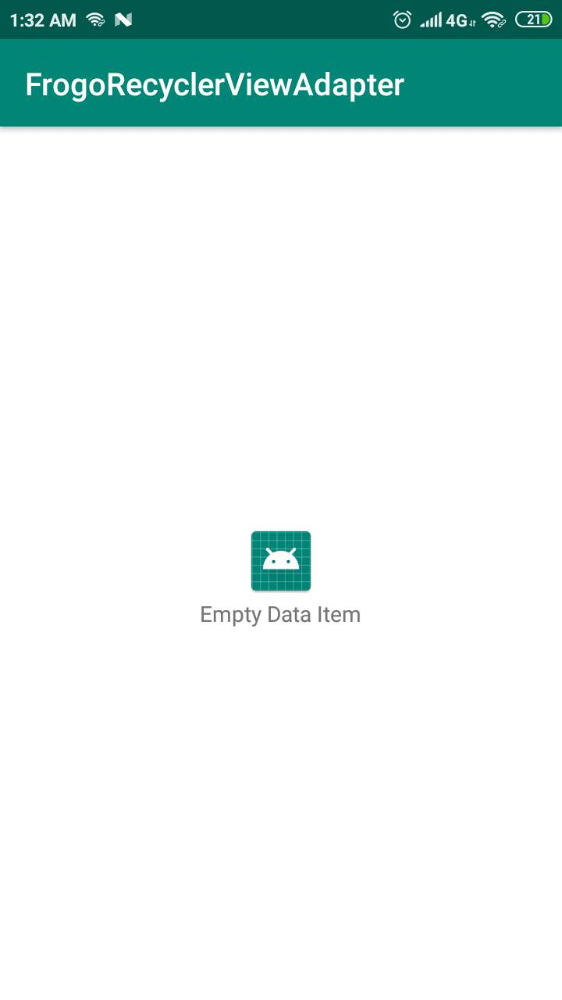

# FrogoRecyclerView by Amirisback
FrogoRecyclerView Extends RecyclerView
- v2.0.4 - Development
- Stable Version

# About This Project
- Easy Adapter Base On RecyclerViewAdapter
- Simple RecyclerViewAdapter
- No longer requires variable declarations
- Just setupRequirement()

# Special From This Custom View

    fun isViewLinearVertical(dividerItem: Boolean) {}
    fun isViewLinearHorizontal(dividerItem: Boolean) {}
    fun isViewStaggeredGrid(spanCount: Int) {}
    fun isViewGrid(spanCount: Int) {}

# Function Main From This Project

    FrogoRecyclerView - In XML file
    FrogoRecyclerViewAdapter<T> - Extend From RecyclerViewAdapter
    FrogoRecyclerViewHolder<T> - Extend From ReyclerView.ViewHolder
    FrogoRecyclerViewListener<T> - Interface for callback function from ViewHolder

# Android Library Version (build.gradle)
- ext.kotlin_version = '1.3.61'
- classpath 'com.android.tools.build:gradle:3.5.3'
- compileSdkVersion 29
- buildToolsVersion "29.0.1"
- minSdkVersion 21

# Version Release
This Is Latest Release

    $version_release = 2.0.4

What's New??

    * Bug Fixed *
    * Adding Function "setupEmptyView(layoutEmptyView) - Can be null"

# How To Use This Project
<h3>Step 1. Add the JitPack repository to your build file</h3>

Add it in your root build.gradle at the end of repositories:

	allprojects {
		repositories {
			...
			maven { url 'https://jitpack.io' }
		}
	}
  
  
<h3>Step 2. Add the dependency</h3>

	dependencies {
	        // library google
	        implementation 'com.google.android.material:material:${latest_version_android}'
            implementation 'androidx.legacy:legacy-support-v4:${latest_version_android}'

            // library frogo-recycler-view
	        implementation 'com.github.amirisback:frogo-recycler-view:${version_release}'
	}
	
		
<h3>Step 3. Create xml view</h3>

    <com.frogobox.recycler.FrogoRecyclerView 
        android:id="@+id/recycler_view"
        android:layout_width="match_parent"
        android:layout_height="match_parent"/>
	
<h3>Step 4. Create adapter</h3>

	(Kotlin) - class MainViewAdapter : FrogoRecyclerViewAdapter<ExampleModel>() {
	(Java) - public class DetailViewAdapter extends FrogoRecyclerViewAdapter<ExampleModel> {

<h3>Step 5. Create Activity Or Fragment</h3>

	(Kotlin) - class MainActivity : AppCompatActivity(), FrogoRecyclerViewListener<ExampleModel> {
	(Java) - public class DetailActivity extends AppCompatActivity implements FrogoRecyclerViewListener<ExampleModel> {
	
<h3>Adapter Main Function</h3>

    fun setupRequirement(viewListener: FrogoRecyclerViewListener<T>?, dataList: List<T>?, layoutItem: Int?)
    fun setupEmptyView(emptyView: Int?)
    
# Sample Code Kotlin and Java
<h3>Sample Code Adapter (Kotlin)</h3>

    class MainViewAdapter : FrogoRecyclerViewAdapter<ExampleModel>() {
    
        override fun onCreateViewHolder(
            parent: ViewGroup,
            viewType: Int
        ): FrogoRecyclerViewHolder<ExampleModel> {
            return ExampleViewHolder(viewLayout(parent))
        }
    
        inner class ExampleViewHolder(view: View) : FrogoRecyclerViewHolder<ExampleModel>(view) {
    
            private val tvExampleItem = view.tv_example_item
    
            override fun initComponent(data: ExampleModel) {
                super.initComponent(data)
    
                tvExampleItem.text = data.name
    
            }
        }
    
    }
    
<h3>Sample Code View Listener (Kotlin)</h3>

    interface MainViewListener : FrogoRecyclerViewListener<ExampleModel> {
    
        override fun onItemClicked(data: ExampleModel) {
            onItemClickedMain(data)
        }
    
        override fun onItemLongClicked(data: ExampleModel) {
            onItemLongClickedMain(data)
        }
    
        fun onItemClickedMain(data: ExampleModel)
    
        fun onItemLongClickedMain(data: ExampleModel)
    
    }

<h3>Sample Code Activity (Kotlin)</h3>

    class MainActivity : AppCompatActivity(), MainViewListener {
    
        override fun onCreate(savedInstanceState: Bundle?) {
            super.onCreate(savedInstanceState)
            setContentView(R.layout.activity_main)
            setupAdapter()
        }
    
        private fun listData(): MutableList<ExampleModel> {
            val listString = mutableListOf<ExampleModel>()
            listString.add(ExampleModel("Amir Is Back"))
            listString.add(ExampleModel("Amir Is Back"))
            listString.add(ExampleModel("Amir Is Back"))
            listString.add(ExampleModel("Amir Is Back"))
            return listString
        }
    
        private fun setupAdapter() {
            val adapter =
                MainViewAdapter()
            adapter.setupRequirement(
                this, listData(),
                R.layout.example_list_item
            )
            adapter.setupEmptyView(R.layout.example_empty_view) // With Custom View
            recycler_view.adapter = adapter
            recycler_view.isViewLinear()
        }
    
        override fun onItemClickedMain(data: ExampleModel) {
            Toast.makeText(this, data.name, Toast.LENGTH_SHORT).show()
        }
    
        override fun onItemLongClickedMain(data: ExampleModel) {
            Toast.makeText(this, data.name, Toast.LENGTH_LONG).show()
        }
    
    }
    
<h3>Sample Code Adapter (Java)</h3>

    public class DetailViewAdapter extends FrogoRecyclerViewAdapter<ExampleModel> {
        @NonNull
        @Override
        public FrogoRecyclerViewHolder<ExampleModel> onCreateViewHolder(@NonNull ViewGroup parent, int viewType) {
            return new DetailViewHolder(parent);
        }
    
        class DetailViewHolder extends FrogoRecyclerViewHolder<ExampleModel> {
    
            private TextView tvExample = itemView.findViewById(R.id.tv_example_item);
    
            public DetailViewHolder(@NotNull View view) {
                super(view);
            }
    
            @Override
            public void initComponent(ExampleModel data) {
                super.initComponent(data);
    
                tvExample.setText(data.getName());
    
            }
        }
    
    }

<h3>Sample Code View Listener (Java)</h3>

    public interface DetailViewListener extends FrogoRecyclerViewListener<ExampleModel> {
    
        @Override
        void onItemClicked(ExampleModel data);
    
        @Override
        void onItemLongClicked(ExampleModel data);
    
    }

<h3>Sample Code Activity (Java)</h3>

    public class DetailActivity extends AppCompatActivity implements DetailViewListener {
    
        @Override
        protected void onCreate(Bundle savedInstanceState) {
            super.onCreate(savedInstanceState);
            setContentView(R.layout.activity_detail);
            setupAdapter();
        }
    
        private ArrayList<ExampleModel> listData(){
            ArrayList<ExampleModel> exampleModels = new ArrayList<>();
            exampleModels.add(new ExampleModel("Amir Is Back"));
            exampleModels.add(new ExampleModel("Amir Is Back"));
            exampleModels.add(new ExampleModel("Amir Is Back"));
            exampleModels.add(new ExampleModel("Amir Is Back"));
            return exampleModels;
        }
    
        private void setupAdapter(){
            DetailViewAdapter adapter = new DetailViewAdapter();
            adapter.setupRequirement(this, listData(), R.layout.example_list_item);
            adapter.setupEmptyView(null); // Without Custom View
            RecyclerView recyclerView = findViewById(R.id.recycler_view);
            recyclerView.setAdapter(adapter);
            recyclerView.isViewLinear();
        }
    
        @Override
        public void onItemClicked(ExampleModel data) {
            Toast.makeText(this, data.getName(), Toast.LENGTH_SHORT).show();
        }
    
        @Override
        public void onItemLongClicked(ExampleModel data) {
            Toast.makeText(this, data.getName(), Toast.LENGTH_LONG).show();
        }
        
    }
    
# Important Note (Caution)
    To avoid conflicts between interfaces,
    
    *******
    
    Try creating your own Interfarce Class by extending FrogoRecyclerViewListener<YourDataClass>. 
    
    *******
    
    Examples can be seen above / clone this project.
    
# Screen Shoot Apps

# Colaborator
Very open to anyone, I'll write your name under this, please contribute by sending an email to me

- Mail To faisalamircs@gmail.com
- Subject : Github _ [Github-Username-Account] _ [Language] _ [Repository-Name]
- Example : Github_amirisback_kotlin_admob-helper-implementation

Name Of Contribute
- Muhammad Faisal Amir
- Waiting List
- Waiting List

Waiting for your contribute

# Attention !!!
Please enjoy and don't forget fork and give a star
- Don't Forget Follow My Github Account