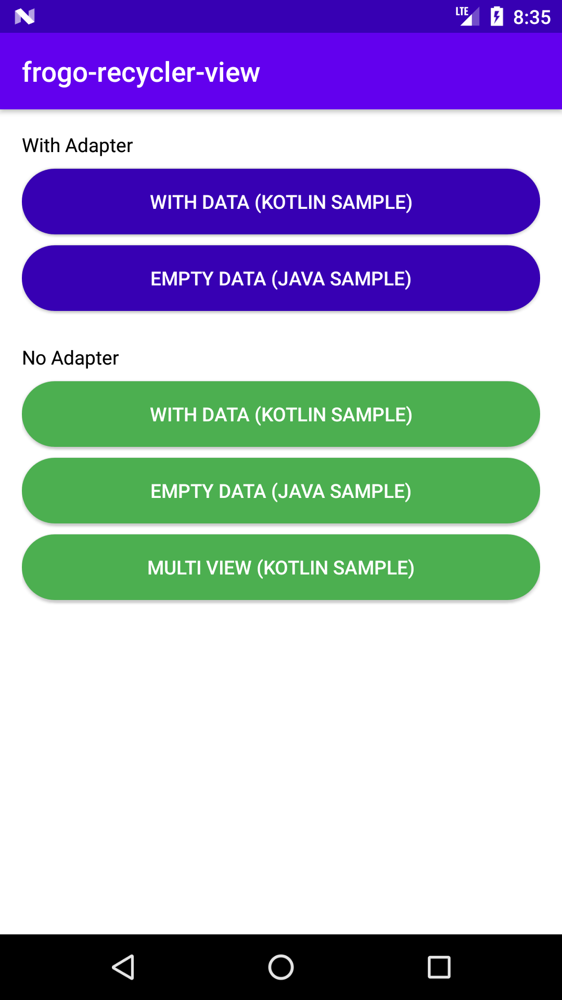
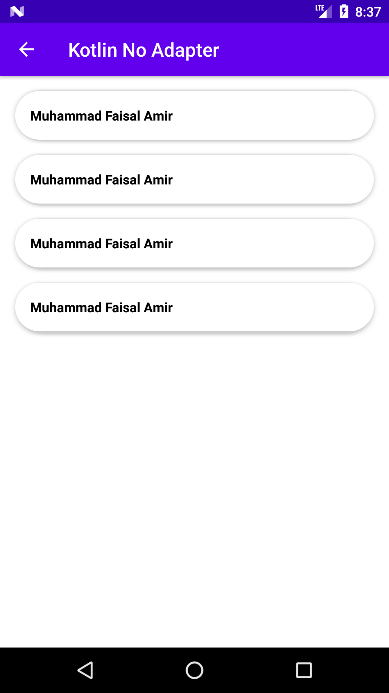
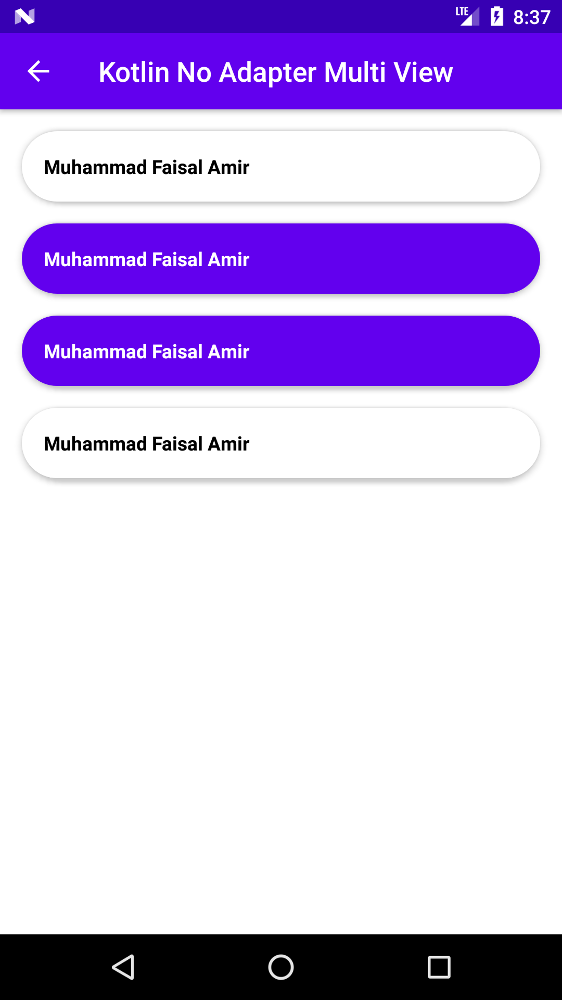

# Attention !!!
- Get Ready for frogo-recycler-view 3.0.0
- It is under heavy development
- previous versions can still be used

# frogo-recycler-view

# Description
FrogoRecyclerView Extends RecyclerView
- Created by amirisback (Muhammad Faisal Amir)
- Development
- Stable Version

# About This Project
- RecyclerView No Adapter (Adapter Has Been Handled)
- RecyclerView Multi-View-Type (only 2 type, still bug on java - beta version)
- Elegant call using injector()
- ViewBinding (Generic Type) *On Development

# Screen Shoot Apps

# Version Release
This Is Latest Release

    $version_release = 2.2.5

What's New??

    * add: Template layout *
    * add: New sample code *
    * update: renaming ids list layout code *
    * please re-import class, because to many refactoring code *
    * fixing bugs *

# Download this project

### Step 1. Add the JitPack repository to your build file (build.gradle : Project)
    
    Add it in your root build.gradle at the end of repositories:
    
    	allprojects {
    		repositories {
    			...
    			maven { url 'https://jitpack.io' }
    		}
    	}
      
### Step 2. Add the dependency (build.gradle : Module)
    
    dependencies {
            // library frogo-recycler-view
            implementation 'com.github.amirisback:frogo-recycler-view:2.2.5'
    }

# Usage (How to use this project)
Just following the step until finish, for basic adapter using step 2, for multi adapter using step 3
    
### Step 1. Create xml view
    
    <com.frogobox.recycler.FrogoRecyclerView 
        android:id="@+id/recycler_view"
        android:layout_width="match_parent"
        android:layout_height="match_parent"/>
    	 	
    	 	
### Step 2. Setup requirement (Basic Adapter)

#### Kotlin (sample using ViewBinding)

    private fun setupFrogoRecyclerView() {

        val adapterCallback = object :
            FrogoViewAdapterCallback<ExampleModel> {
            override fun setupInitComponent(view: View, data: ExampleModel) {
                // Init component content item recyclerview
                view.findViewById<TextView>(R.id.tv_example_item).text = data.name
            }

            override fun onItemClicked(data: ExampleModel) {
                // setup item clicked on frogo recycler view
                showToast(data.name)
            }

            override fun onItemLongClicked(data: ExampleModel) {
                // setup item long clicked on frogo recycler view
                showToast(data.name)
            }
        }

        activityFrogoRvSampleBinding.frogoRecyclerView
            .injector<ExampleModel>()
            .addData(listData())
            .addCustomView(R.layout.frogo_rv_list_type_1)
            .addEmptyView(null)
            .addCallback(adapterCallback)
            .createLayoutLinearVertical(false)
            .build()
    }

#### Java (sample using ViewBinding)

    private void setupFrogoRecyclerView() {

        FrogoViewAdapterCallback frogoViewAdapterCallback = new FrogoViewAdapterCallback<ExampleModel>() {
            @Override
            public void setupInitComponent(@NotNull View view, ExampleModel data) {
                // Init component content item recyclerview
                TextView tvExample = view.findViewById(R.id.tv_example_item);
                tvExample.setText(data.getName());
            }

            @Override
            public void onItemClicked(ExampleModel data) {
                // setup item clicked on frogo recycler view
                showToast(data.getName());
            }

            @Override
            public void onItemLongClicked(ExampleModel data) {
                // setup item long clicked on frogo recycler view
                showToast(data.getName());
            }
        };

        activityFrogoRvSampleBinding.frogoRecyclerView
                .injector()
                .addData(listData())
                .addCustomView(R.layout.frogo_rv_list_type_1)
                .addEmptyView(null)
                .addCallback(frogoViewAdapterCallback)
                .createLayoutLinearVertical(false)
                .build();

    }
    	
    	
### Step 3. Setup requirement (Multi Adapter)

#### List Value Option 
    const val OPTION_HOLDER_FIRST = 0
    const val OPTION_HOLDER_SECOND = 1

#### Kotlin (using injector singleton - sample using ViewBinding)

    private fun setupFrogoRecyclerView() {

        val adapterCallback = object : FrogoViewAdapterMultiCallback<ExampleModel> {
            override fun setupFirstInitComponent(view: View, data: ExampleModel) {
                // Init component content item recyclerview
                view.findViewById<TextView>(R.id.tv_example_item).text = data.name
            }

            override fun setupSecondInitComponent(view: View, data: ExampleModel) {
                // Init component content item recyclerview
                view.findViewById<TextView>(R.id.tv_example_item).text = data.name
            }

            override fun onFirstItemClicked(data: ExampleModel) {
                showToast(data.name + " First")
            }

            override fun onFirstItemLongClicked(data: ExampleModel) {
                showToast("LAYOUT TYPE 1")
            }

            override fun onSecondItemClicked(data: ExampleModel) {
                showToast(data.name + " Second")
            }

            override fun onSecondItemLongClicked(data: ExampleModel) {
                showToast("LAYOUT TYPE 2")
            }
        }

        activityFrogoRvSampleBinding.frogoRecyclerView
            .injectorMulti<ExampleModel>()
            .addData(listData())
            .addCustomView(listLayout())
            .addOptionHolder(listOption())
            .addCallback(adapterCallback)
            .addEmptyView(null)
            .createLayoutLinearVertical(false)
            .build()
    }

#### Java (sample using ViewBinding)

    private void setupFrogoRecyclerView() {
        FrogoRecyclerView frogoRecyclerView = activityFrogoRvSampleBinding.frogoRecyclerView;

        frogoRecyclerView.injectAdapterMultiType(
                listData(),
                listLayout(),
                listOption(),
                null,
                new FrogoViewAdapterMultiCallback<ExampleModel>() {

                    @Override
                    public void setupFirstInitComponent(@NotNull View view, ExampleModel data) {
                        TextView tvExampleItem = findViewById(R.id.tv_example_item);
                        tvExampleItem.setText(data.getName());
                    }

                    @Override
                    public void onFirstItemClicked(ExampleModel data) {
                        showToast(data.getName() + " 1");
                    }

                    @Override
                    public void onFirstItemLongClicked(ExampleModel data) {
                        showToast(data.getName() + " First");
                    }

                    @Override
                    public void setupSecondInitComponent(@NotNull View view, ExampleModel data) {
                        TextView tvExampleItem = findViewById(R.id.tv_example_item);
                        tvExampleItem.setText(data.getName());
                    }

                    @Override
                    public void onSecondItemClicked(ExampleModel data) {
                        showToast(data.getName() + " 2");
                    }

                    @Override
                    public void onSecondItemLongClicked(ExampleModel data) {
                        showToast(data.getName() + " Second");
                    }
                }
        );
        frogoRecyclerView.isViewLinearVertical(false);

    }

# Sample Code 
## No Adapter
- Kotlin - https://github.com/amirisback/frogo-recycler-view/blob/master/app/src/main/java/com/frogobox/recycler/kotlinsample/KotlinNoAdapterActivity.kt
- Java - https://github.com/amirisback/frogo-recycler-view/blob/master/app/src/main/java/com/frogobox/recycler/javasample/JavaNoAdapterActivity.java

## No Adapter (Multi-type-view)
- Kotlin - https://github.com/amirisback/frogo-recycler-view/blob/master/app/src/main/java/com/frogobox/recycler/kotlinsample/KotlinNoAdapterMultiVewActivity.kt
- Java - https://github.com/amirisback/frogo-recycler-view/blob/master/app/src/main/java/com/frogobox/recycler/javasample/JavaNoAdapterMultiViewActivity.java

## With Adapter (Some function deprecated)
- Kotlin - https://github.com/amirisback/frogo-recycler-view/tree/master/app/src/main/java/com/frogobox/recycler/kotlinsample/usingadapter
- Java - https://github.com/amirisback/frogo-recycler-view/tree/master/app/src/main/java/com/frogobox/recycler/javasample/usingadapter

# Extension Resource

## drawable

    frogo_rv_bg_accent_16dp.xml
    frogo_rv_bg_accent_32dp.xml
    frogo_rv_bg_accent_4dp.xml
    frogo_rv_bg_accent_8dp.xml
    frogo_rv_bg_amber_16dp.xml
    frogo_rv_bg_amber_32dp.xml
    frogo_rv_bg_amber_4dp.xml
    frogo_rv_bg_amber_8dp.xml
    frogo_rv_bg_black_16dp.xml
    frogo_rv_bg_black_32dp.xml
    frogo_rv_bg_black_4dp.xml
    frogo_rv_bg_black_8dp.xml
    frogo_rv_bg_blue_16dp.xml
    frogo_rv_bg_blue_32dp.xml
    frogo_rv_bg_blue_4dp.xml
    frogo_rv_bg_blue_8dp.xml
    frogo_rv_bg_card_16dp.xml
    frogo_rv_bg_card_32dp.xml
    frogo_rv_bg_card_4dp.xml
    frogo_rv_bg_card_8dp.xml
    frogo_rv_bg_cyan_16dp.xml
    frogo_rv_bg_cyan_32dp.xml
    frogo_rv_bg_cyan_4dp.xml
    frogo_rv_bg_cyan_8dp.xml
    frogo_rv_bg_dark_yellow_16dp.xml
    frogo_rv_bg_dark_yellow_32dp.xml
    frogo_rv_bg_dark_yellow_4dp.xml
    frogo_rv_bg_dark_yellow_8dp.xml
    frogo_rv_bg_deep_purple_16dp.xml
    frogo_rv_bg_deep_purple_32dp.xml
    frogo_rv_bg_deep_purple_4dp.xml
    frogo_rv_bg_deep_purple_8dp.xml
    frogo_rv_bg_green_16dp.xml
    frogo_rv_bg_green_32dp.xml
    frogo_rv_bg_green_4dp.xml
    frogo_rv_bg_green_8dp.xml
    frogo_rv_bg_indigo_16dp.xml
    frogo_rv_bg_indigo_32dp.xml
    frogo_rv_bg_indigo_4dp.xml
    frogo_rv_bg_indigo_8dp.xml
    frogo_rv_bg_light_blue_16dp.xml
    frogo_rv_bg_light_blue_32dp.xml
    frogo_rv_bg_light_blue_4dp.xml
    frogo_rv_bg_light_blue_8dp.xml
    frogo_rv_bg_light_green_16dp.xml
    frogo_rv_bg_light_green_32dp.xml
    frogo_rv_bg_light_green_4dp.xml
    frogo_rv_bg_light_green_8dp.xml
    frogo_rv_bg_lime_16dp.xml
    frogo_rv_bg_lime_32dp.xml
    frogo_rv_bg_lime_4dp.xml
    frogo_rv_bg_lime_8dp.xml
    frogo_rv_bg_orange_16dp.xml
    frogo_rv_bg_orange_32dp.xml
    frogo_rv_bg_orange_4dp.xml
    frogo_rv_bg_orange_8dp.xml
    frogo_rv_bg_pink_16dp.xml
    frogo_rv_bg_pink_32dp.xml
    frogo_rv_bg_pink_4dp.xml
    frogo_rv_bg_pink_8dp.xml
    frogo_rv_bg_primary_16dp.xml
    frogo_rv_bg_primary_32dp.xml
    frogo_rv_bg_primary_4dp.xml
    frogo_rv_bg_primary_8dp.xml
    frogo_rv_bg_primary_dark_16dp.xml
    frogo_rv_bg_primary_dark_32dp.xml
    frogo_rv_bg_primary_dark_4dp.xml
    frogo_rv_bg_primary_dark_8dp.xml
    frogo_rv_bg_purple_16dp.xml
    frogo_rv_bg_purple_32dp.xml
    frogo_rv_bg_purple_4dp.xml
    frogo_rv_bg_purple_8dp.xml
    frogo_rv_bg_red_16dp.xml
    frogo_rv_bg_red_32dp.xml
    frogo_rv_bg_red_4dp.xml
    frogo_rv_bg_red_8dp.xml
    frogo_rv_bg_teal_16dp.xml
    frogo_rv_bg_teal_32dp.xml
    frogo_rv_bg_teal_4dp.xml
    frogo_rv_bg_teal_8dp.xml
    frogo_rv_bg_white_16dp.xml
    frogo_rv_bg_white_32dp.xml
    frogo_rv_bg_white_4dp.xml
    frogo_rv_bg_white_8dp.xml
    frogo_rv_bg_yellow_16dp.xml
    frogo_rv_bg_yellow_32dp.xml
    frogo_rv_bg_yellow_4dp.xml
    frogo_rv_bg_yellow_8dp.xml
    frogo_rv_bg_yellow_lime_16dp.xml
    frogo_rv_bg_yellow_lime_32dp.xml
    frogo_rv_bg_yellow_lime_4dp.xml
    frogo_rv_bg_yellow_lime_8dp.xml
    frogo_rv_ic_empty_view.xml
    
## values
### dimens

    <!--  Frogo Rv Base Dimen  -->
    <dimen name="frogo_rv_dimen_1dp">1dp</dimen>
    <dimen name="frogo_rv_dimen_2dp">2dp</dimen>
    <dimen name="frogo_rv_dimen_4dp">4dp</dimen>
    <dimen name="frogo_rv_dimen_6dp">6dp</dimen>
    <dimen name="frogo_rv_dimen_8dp">8dp</dimen>
    <dimen name="frogo_rv_dimen_10dp">10dp</dimen>
    <dimen name="frogo_rv_dimen_12dp">12dp</dimen>
    <dimen name="frogo_rv_dimen_14dp">14dp</dimen>
    <dimen name="frogo_rv_dimen_16dp">16dp</dimen>
    <dimen name="frogo_rv_dimen_18dp">18dp</dimen>
    <dimen name="frogo_rv_dimen_20dp">20dp</dimen>
    <dimen name="frogo_rv_dimen_22dp">22dp</dimen>
    <dimen name="frogo_rv_dimen_24dp">24dp</dimen>
    <dimen name="frogo_rv_dimen_26dp">26dp</dimen>
    <dimen name="frogo_rv_dimen_28dp">28dp</dimen>
    <dimen name="frogo_rv_dimen_30dp">30dp</dimen>
    <dimen name="frogo_rv_dimen_32dp">32dp</dimen>
    <dimen name="frogo_rv_dimen_34dp">34dp</dimen>
    <dimen name="frogo_rv_dimen_36dp">36dp</dimen>
    <dimen name="frogo_rv_dimen_38dp">38dp</dimen>
    <dimen name="frogo_rv_dimen_40dp">40dp</dimen>
    <dimen name="frogo_rv_dimen_42dp">42dp</dimen>
    <dimen name="frogo_rv_dimen_44dp">44dp</dimen>
    <dimen name="frogo_rv_dimen_46dp">46dp</dimen>
    <dimen name="frogo_rv_dimen_48dp">48dp</dimen>
    <dimen name="frogo_rv_dimen_50dp">50dp</dimen>
    <dimen name="frogo_rv_dimen_52dp">52dp</dimen>
    <dimen name="frogo_rv_dimen_54dp">54dp</dimen>
    <dimen name="frogo_rv_dimen_56dp">56dp</dimen>
    <dimen name="frogo_rv_dimen_58dp">58dp</dimen>
    <dimen name="frogo_rv_dimen_60dp">60dp</dimen>
    <dimen name="frogo_rv_dimen_62dp">62dp</dimen>
    <dimen name="frogo_rv_dimen_64dp">64dp</dimen>
    <dimen name="frogo_rv_dimen_66dp">66dp</dimen>
    <dimen name="frogo_rv_dimen_68dp">68dp</dimen>
    <dimen name="frogo_rv_dimen_70dp">70dp</dimen>
    <dimen name="frogo_rv_dimen_72dp">72dp</dimen>
    <dimen name="frogo_rv_dimen_74dp">74dp</dimen>
    <dimen name="frogo_rv_dimen_76dp">76dp</dimen>
    <dimen name="frogo_rv_dimen_78dp">78dp</dimen>
    <dimen name="frogo_rv_dimen_80dp">80dp</dimen>
    <dimen name="frogo_rv_dimen_82dp">82dp</dimen>
    <dimen name="frogo_rv_dimen_84dp">84dp</dimen>
    <dimen name="frogo_rv_dimen_86dp">86dp</dimen>
    <dimen name="frogo_rv_dimen_88dp">88dp</dimen>
    <dimen name="frogo_rv_dimen_90dp">90dp</dimen>
    <dimen name="frogo_rv_dimen_92dp">92dp</dimen>
    <dimen name="frogo_rv_dimen_94dp">94dp</dimen>
    <dimen name="frogo_rv_dimen_96dp">96dp</dimen>
    <dimen name="frogo_rv_dimen_98dp">98dp</dimen>
    <dimen name="frogo_rv_dimen_100dp">100dp</dimen>
    <dimen name="frogo_rv_dimen_102dp">102dp</dimen>
    <dimen name="frogo_rv_dimen_104dp">104dp</dimen>
    <dimen name="frogo_rv_dimen_106dp">106dp</dimen>
    <dimen name="frogo_rv_dimen_108dp">108dp</dimen>
    <dimen name="frogo_rv_dimen_110dp">110dp</dimen>
    <dimen name="frogo_rv_dimen_112dp">112dp</dimen>
    <dimen name="frogo_rv_dimen_114dp">114dp</dimen>
    <dimen name="frogo_rv_dimen_116dp">116dp</dimen>
    <dimen name="frogo_rv_dimen_118dp">118dp</dimen>
    <dimen name="frogo_rv_dimen_120dp">120dp</dimen>
    <dimen name="frogo_rv_dimen_122dp">122dp</dimen>
    <dimen name="frogo_rv_dimen_124dp">124dp</dimen>
    <dimen name="frogo_rv_dimen_126dp">126dp</dimen>
    <dimen name="frogo_rv_dimen_128dp">128dp</dimen>
    <dimen name="frogo_rv_dimen_130dp">130dp</dimen>
    
    <dimen name="frogo_rv_dimen_8sp">8sp</dimen>
    <dimen name="frogo_rv_dimen_9sp">9sp</dimen>
    <dimen name="frogo_rv_dimen_10sp">10sp</dimen>
    <dimen name="frogo_rv_dimen_11sp">11sp</dimen>
    <dimen name="frogo_rv_dimen_12sp">12sp</dimen>
    <dimen name="frogo_rv_dimen_13sp">13sp</dimen>
    <dimen name="frogo_rv_dimen_14sp">14sp</dimen>
    <dimen name="frogo_rv_dimen_15sp">15sp</dimen>
    <dimen name="frogo_rv_dimen_16sp">16sp</dimen>
    <dimen name="frogo_rv_dimen_18sp">18sp</dimen>
    <dimen name="frogo_rv_dimen_20sp">20sp</dimen>
    <dimen name="frogo_rv_dimen_22sp">22sp</dimen>
    <dimen name="frogo_rv_dimen_24sp">24sp</dimen>

### colors

    <color name="frogoRvColorPrimary">#6200EE</color>
    <color name="frogoRvColorPrimaryDark">#3700B3</color>
    <color name="frogoRvColorAccent">#03DAC5</color>

    <!-- Frogo Rv Base Color-->
    <color name="frogoRvColorWhite">#FFFFFF</color>
    <color name="frogoRvColorBlack">#000000</color>
    <color name="frogoRvColorRed">#F44336</color>
    <color name="frogoRvColorPink">#E91E63</color>
    <color name="frogoRvColorPurple">#9C27B0</color>
    <color name="frogoRvColorDeepPurple">#673AB7</color>
    <color name="frogoRvColorIndigo">#3F51B5</color>
    <color name="frogoRvColorBlue">#2196F3</color>
    <color name="frogoRvColorLightBlue">#03A9F4</color>
    <color name="frogoRvColorCyan">#00BCD4</color>
    <color name="frogoRvColorTeal">#009688</color>
    <color name="frogoRvColorGreen">#4CAF50</color>
    <color name="frogoRvColorLightGreen">#8BC34A</color>
    <color name="frogoRvColorLime">#CDDC39</color>
    <color name="frogoRvColorYellowLime">#CDDC39</color>
    <color name="frogoRvColorYellow">#FFEB3B</color>
    <color name="frogoRvColorDarkYellow">#FFC107</color>
    <color name="frogoRvColorAmber">#FF9800</color>
    <color name="frogoRvColorOrange">#FF5722</color>

### styles

    <!-- Util -->

    

    

    

    

    

    

    <!-- TextView -->

    

    

    

    <!-- Layout Container -->

    

    

    
    

### strings

    <!--  Frogo Rv Base String  -->
    <string name="frogo_rv_is_empty_data">is Empty Data</string>
    <string name="frogo_rv_no_data_found">No data found</string>
    <string name="frogo_rv_please_insert_data">Please insert data here !!!</string>
    <string name="iv_poster">iv_poster</string>

### ids

    <resources>
    
    <!-- frogo_rv_list_type_1.xml -->
    <item type="id" name="frogo_rv_list_type_1_root_linear_layout"/>
    <item type="id" name="frogo_rv_list_type_1_tv_title"/>

    <!-- frogo_rv_list_type_2.xml -->
    <item type="id" name="frogo_rv_list_type_2_root_linear_layout"/>
    <item type="id" name="frogo_rv_list_type_2_tv_title"/>
    <item type="id" name="frogo_rv_list_type_2_tv_subtitle"/>

    <!-- frogo_rv_list_type_3.xml -->
    <item type="id" name="frogo_rv_list_type_3_root_linear_layout"/>
    <item type="id" name="frogo_rv_list_type_3_tv_title"/>
    <item type="id" name="frogo_rv_list_type_3_tv_subtitle"/>
    <item type="id" name="frogo_rv_list_type_3_tv_desc"/>

    <!-- frogo_rv_list_type_4.xml -->
    <item type="id" name="frogo_rv_list_type_4_root_relative_layout"/>
    <item type="id" name="frogo_rv_list_type_4_iv_poster"/>
    <item type="id" name="frogo_rv_list_type_4_tv_title"/>

    <!-- frogo_rv_list_type_5.xml -->
    <item type="id" name="frogo_rv_list_type_5_root_relative_layout"/>
    <item type="id" name="frogo_rv_list_type_5_container_linear_layout"/>
    <item type="id" name="frogo_rv_list_type_5_iv_poster"/>
    <item type="id" name="frogo_rv_list_type_5_tv_title"/>
    <item type="id" name="frogo_rv_list_type_5_tv_subtitle"/>

    <!-- frogo_rv_list_type_6.xml -->
    <item type="id" name="frogo_rv_list_type_6_root_relative_layout"/>
    <item type="id" name="frogo_rv_list_type_6_container_linear_layout"/>
    <item type="id" name="frogo_rv_list_type_6_iv_poster"/>
    <item type="id" name="frogo_rv_list_type_6_tv_title"/>
    <item type="id" name="frogo_rv_list_type_6_tv_subtitle"/>
    <item type="id" name="frogo_rv_list_type_6_tv_desc"/>

    <!-- frogo_rv_list_type_7.xml -->
    <item type="id" name="frogo_rv_list_type_7_root_relative_layout"/>
    <item type="id" name="frogo_rv_list_type_7_civ_poster"/>
    <item type="id" name="frogo_rv_list_type_7_tv_title"/>

    <!-- frogo_rv_list_type_8.xml -->
    <item type="id" name="frogo_rv_list_type_8_root_relative_layout"/>
    <item type="id" name="frogo_rv_list_type_8_container_linear_layout"/>
    <item type="id" name="frogo_rv_list_type_8_civ_poster"/>
    <item type="id" name="frogo_rv_list_type_8_tv_title"/>
    <item type="id" name="frogo_rv_list_type_8_tv_subtitle"/>

    <!-- frogo_rv_list_type_9.xml -->
    <item type="id" name="frogo_rv_list_type_9_root_linear_layout"/>
    <item type="id" name="frogo_rv_list_type_9_iv_poster"/>
    <item type="id" name="frogo_rv_list_type_9_tv_title"/>

    <!-- frogo_rv_list_type_10.xml -->
    <item type="id" name="frogo_rv_list_type_10_root_linear_layout"/>
    <item type="id" name="frogo_rv_list_type_10_iv_poster"/>
    <item type="id" name="frogo_rv_list_type_10_tv_title"/>
    <item type="id" name="frogo_rv_list_type_10_tv_subtitle"/>

    <!-- frogo_rv_list_type_11.xml -->
    <item type="id" name="frogo_rv_list_type_11_root_linear_layout"/>
    <item type="id" name="frogo_rv_list_type_11_iv_poster"/>
    <item type="id" name="frogo_rv_list_type_11_tv_title"/>
    <item type="id" name="frogo_rv_list_type_11_tv_subtitle"/>
    <item type="id" name="frogo_rv_list_type_11_tv_desc"/>

    <!-- frogo_rv_list_type_12.xml -->
    <item type="id" name="frogo_rv_list_type_12_root_linear_layout"/>
    <item type="id" name="frogo_rv_list_type_12_tv_title"/>

    <!--  =====================================================================================  -->

    <!-- frogo_rv_grid_type_1.xml -->
    <item type="id" name="frogo_rv_grid_type_1_root_linear_layout"/>
    <item type="id" name="frogo_rv_grid_type_1_iv_poster"/>
    <item type="id" name="frogo_rv_grid_type_1_tv_title"/>

    <!-- frogo_rv_grid_type_2.xml -->
    <item type="id" name="frogo_rv_grid_type_2_root_linear_layout"/>
    <item type="id" name="frogo_rv_grid_type_2_iv_poster"/>
    <item type="id" name="frogo_rv_grid_type_2_tv_title"/>
    <item type="id" name="frogo_rv_grid_type_2_tv_subtitle"/>

    <!-- frogo_rv_grid_type_3.xml -->
    <item type="id" name="frogo_rv_grid_type_3_root_linear_layout"/>
    <item type="id" name="frogo_rv_grid_type_3_iv_poster"/>
    <item type="id" name="frogo_rv_grid_type_3_tv_title"/>
    <item type="id" name="frogo_rv_grid_type_3_tv_subtitle"/>
    <item type="id" name="frogo_rv_grid_type_3_tv_desc"/>

    <!-- frogo_rv_grid_type_4.xml -->
    <item type="id" name="frogo_rv_grid_type_4_root_linear_layout"/>
    <item type="id" name="frogo_rv_grid_type_4_civ_poster"/>
    <item type="id" name="frogo_rv_grid_type_4_tv_title"/>

    <!-- frogo_rv_grid_type_5.xml -->
    <item type="id" name="frogo_rv_grid_type_5_root_linear_layout"/>
    <item type="id" name="frogo_rv_grid_type_5_civ_poster"/>
    <item type="id" name="frogo_rv_grid_type_5_tv_title"/>
    <item type="id" name="frogo_rv_grid_type_5_tv_subtitle"/>

    <!-- frogo_rv_grid_type_6.xml -->
    <item type="id" name="frogo_rv_grid_type_6_root_linear_layout"/>
    <item type="id" name="frogo_rv_grid_type_6_civ_poster"/>
    <item type="id" name="frogo_rv_grid_type_6_tv_title"/>
    <item type="id" name="frogo_rv_grid_type_6_tv_subtitle"/>
    <item type="id" name="frogo_rv_grid_type_6_tv_desc"/>

    <!-- frogo_rv_grid_type_7.xml -->
    <item type="id" name="frogo_rv_grid_type_7_root_linear_layout"/>
    <item type="id" name="frogo_rv_grid_type_7_iv_poster"/>

    <!--  =====================================================================================  -->

    <!-- frogo_rv_empty_view.xml -->
    <item type="id" name="frogo_rv_empty_root_linear_layout"/>
    <item type="id" name="frogo_rv_empty_iv_poster"/>
    <item type="id" name="frogo_rv_empty_tv_title"/>
    <item type="id" name="frogo_rv_empty_tv_subtitle"/>

    <!--  =====================================================================================  -->

    <!-- frogo_rv_root_grid_type.xml -->
    <item type="id" name="frogo_rv_grid_root"/>
    <item type="id" name="frogo_rv_grid_view"/>
    <item type="id" name="frogo_rv_grid_progress_view"/>

    <!--  =====================================================================================  -->

    <!-- frogo_rv_root_list_type.xml -->
    <item type="id" name="frogo_rv_list_root"/>
    <item type="id" name="frogo_rv_list_view"/>
    <item type="id" name="frogo_rv_list_progress_view"/>
    
    </resources>

## layout

    frogo_rv_container_empty_view.xml
    frogo_rv_empty_view.xml
    frogo_rv_grid_type_1.xml
    frogo_rv_grid_type_2.xml
    frogo_rv_grid_type_3.xml
    frogo_rv_grid_type_4.xml
    frogo_rv_grid_type_5.xml
    frogo_rv_grid_type_6.xml
    frogo_rv_grid_type_7.xml
    frogo_rv_list_type_1.xml
    frogo_rv_list_type_2.xml
    frogo_rv_list_type_3.xml
    frogo_rv_list_type_4.xml
    frogo_rv_list_type_5.xml
    frogo_rv_list_type_6.xml
    frogo_rv_list_type_7.xml
    frogo_rv_list_type_8.xml
    frogo_rv_list_type_9.xml
    frogo_rv_list_type_10.xml
    frogo_rv_list_type_11.xml
    frogo_rv_list_type_12.xml
    frogo_rv_root_grid_type.xml
    frogo_rv_root_list_type.xml

# Colaborator
Very open to anyone, I'll write your name under this, please contribute by sending an email to me

- Mail To faisalamircs@gmail.com
- Subject : Github _ [Github-Username-Account] _ [Language] _ [Repository-Name]
- Example : Github_amirisback_kotlin_admob-helper-implementation

Name Of Contribute
- Muhammad Faisal Amir
- Waiting List
- Waiting List

Waiting for your contribute

# Attention !!!
- Please enjoy and don't forget fork and give a star
- Don't Forget Follow My Github Account