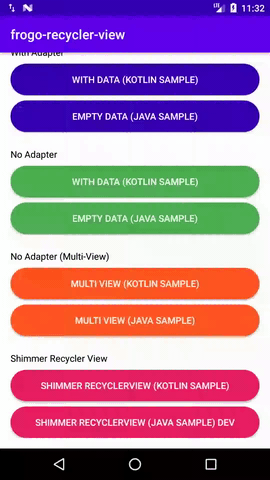

# About This Project

- RecyclerView No Adapter (Adapter Has Been Handled)
- RecyclerView Multi-View-Type (Stable - Multi ViewHolder)
- Elegant call using injector()
- Shimmer Effect
- Empty View Effect

# Screen Shoot Apps

List Function        |   Frogo Shimmer RecyclerView |   Frogo Multi View   | Simple Empty View |
:------------------:|:----------------------------:|:---------------------:|:-----------------:|
 |  |  |  |

# Version Release
This Is Latest Release

    $version_release = 3.3.1

What's New??

    * Refactoring Code *
    * Enhance Performance *
    * Update build.gradle *
    * Update class name *
    * Simplify Shimmer Core *

# Download this project

### Step 1. Add the JitPack repository to your build file (build.gradle : Project)
    
    Add it in your root build.gradle at the end of repositories:
    
    	allprojects {
    		repositories {
    			...
    			maven { url 'https://jitpack.io' }
    		}
    	}
      
### Step 2. Add the dependency (build.gradle : Module)
    
    dependencies {
            // library frogo-recycler-view
            implementation 'com.github.amirisback:frogo-recycler-view:3.3.1'
    }

# Tutorial
- FrogoRecyclerView [Click Here](https://github.com/amirisback/frogo-recycler-view/blob/master/docs/tutorial/FrogoRecyclerView.md)
- FrogoShimmerRecyclerView [Click Here](https://github.com/amirisback/frogo-recycler-view/blob/master/docs/tutorial/FrogoShimmerRecyclerView.md)

# Wiki
- Frogo-UI-Kit Library [Click Here](https://github.com/amirisback/frogo-ui-kit)
- Development Planning [Click Here](https://github.com/amirisback/frogo-recycler-view/wiki/Development-Planning)

##  Alert

    Cautions :
    >> under Version 3.0.1
    - Please implement library [frogo-ui-kit](https://github.com/amirisback/frogo-ui-kit) in your project
    - We separating resource ui for better maintenance

    >> on Version 3.2.0
    - If you use version under 3.2.0 you must pay attenttion to package import
    - Please re-import package
    - Package name [base, parent, boilerplate] updated to core

    >> on Version 3.3.0 up
    - If you use version under 3.3.0 you must pay attenttion to package import
    - Please re-import package
    - Package name [base, parent, boilerplate] updated to core
    - No more package name [viewrclass, viewbinding, viewshimmer] all in core

    Update :
    >> on Version 3.2.0
    from -> import com.frogobox.recycler.boilerplate.viewrclass.FrogoViewAdapterCallback
    to -> import com.frogobox.recycler.core.viewrclass.FrogoViewAdapterCallback

    >> on Version 3.3.0 up
    from -> import com.frogobox.recycler.core.viewrclass.FrogoViewAdapterCallback
    to -> import com.frogobox.recycler.core.IFrogoViewAdapter

    >> on Version 3.3.0 up
    from -> FrogoViewAdapterCallback
    to -> IFrogoViewAdapter

# Colaborator
Very open to anyone, I'll write your name under this, please contribute by sending an email to me

- Mail To faisalamircs@gmail.com
- Subject : Github _ [Github-Username-Account] _ [Language] _ [Repository-Name]
- Example : Github_amirisback_kotlin_admob-helper-implementation

Name Of Contribute
- Muhammad Faisal Amir
- Waiting List
- Waiting List

Waiting for your contribute

# Attention !!!
- Please enjoy and don't forget fork and give a star
- Don't Forget Follow My Github Account
