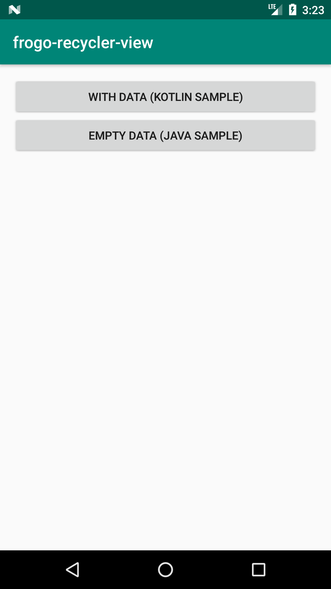
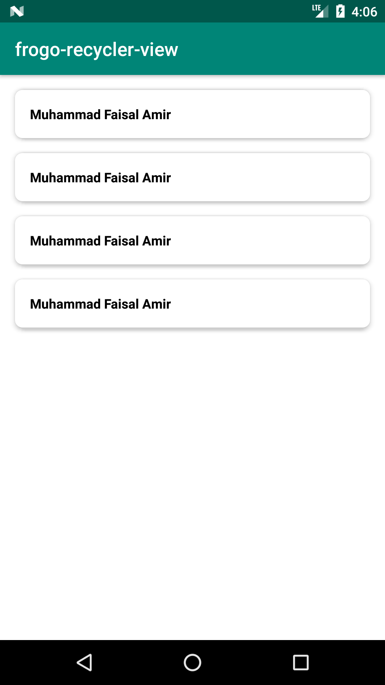
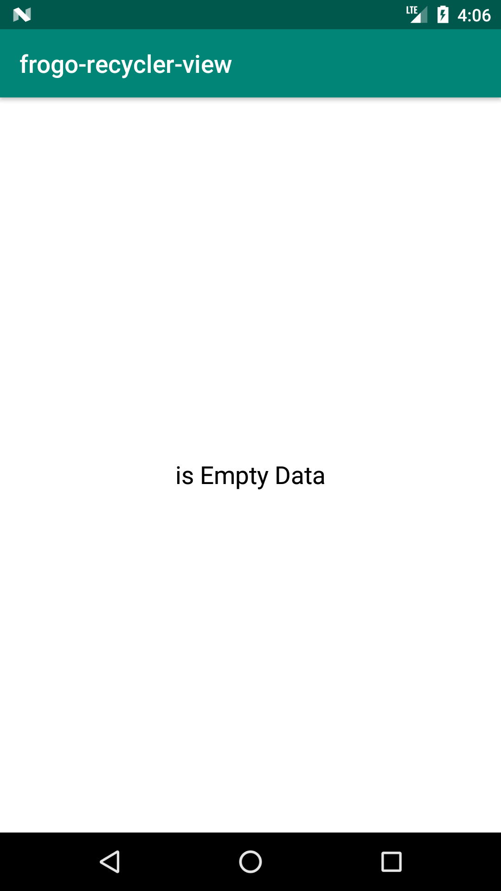

# frogo-recycler-view by Amirisback (Muhammad Faisal Amir)
FrogoRecyclerView Extends RecyclerView
- v2.1.2 - Development
- Stable Version

# About This Project
- Easy Adapter Base On RecyclerViewAdapter
- Simple RecyclerViewAdapter
- No longer requires variable declarations
- Just setupRequirement()

# Plan Development
- RecyclerView without adapter
- Simpifly code
- Bug fixing

# Special From This Custom View

    // Setup linear vertical recycler view
    fun isViewLinearVertical(dividerItem: Boolean) {}

    // Setup linear horizontal recycler view
    fun isViewLinearHorizontal(dividerItem: Boolean) {}

    // Setup staggered grid recycler view
    fun isViewStaggeredGrid(spanCount: Int) {}

    // Setup grid recycler view
    fun isViewGrid(spanCount: Int) {}

# Function Main From This Project

    FrogoRecyclerView - In XML file
    FrogoRecyclerViewAdapter<T> - Extend From RecyclerViewAdapter
    FrogoRecyclerViewHolder<T> - Extend From ReyclerView.ViewHolder
    FrogoRecyclerViewListener<T> - Interface for callback function from ViewHolder
    
# You can just use the adapter
only extending FrogoRecyclerViewAdapter<T> to your adapter and using RecyclerView ordinary

## Interface FrogoAdapterView

    // Setup adapter requirement
    fun setupRequirement(
        layoutItem: Int,
        dataList: List<T>?,
        viewListener: FrogoRecyclerViewListener<T>?
    )

    // Setup empty view for layout
    fun setupEmptyView(emptyView: Int?)

    // Setup view layout
    fun viewLayout(parent: ViewGroup): View

## Interface FrogoHolderView

    // bind item data
    fun bindItem(data: T?, listener: FrogoRecyclerViewListener<T>?)

    // setup on item view clicked
    fun onItemViewClicked(data: T?, listener: FrogoRecyclerViewListener<T>?)

    // Initiation all component
    fun initComponent(data: T)

# Screen Shoot Apps

# Android Library Version (build.gradle)
- ext.kotlin_version = '1.3.71'
- classpath 'com.android.tools.build:gradle:3.6.1'
- compileSdkVersion 29
- buildToolsVersion "29.0.3"
- minSdkVersion 21

# Version Release
This Is Latest Release

    $version_release = 2.1.2

What's New??

    * New sample code *
    * frogo_rv_bg_card.xml *
    * frogo_rv_dimens.xml *

# How To Use This Project
<h3>Step 1. Add the JitPack repository to your build file</h3>

Add it in your root build.gradle at the end of repositories:

	allprojects {
		repositories {
			...
			maven { url 'https://jitpack.io' }
		}
	}
  
<h3>Step 2. Add the dependency</h3>

	dependencies {
	        // library google
	        implementation 'com.google.android.material:material:${latest_version_android}'
            implementation 'androidx.legacy:legacy-support-v4:${latest_version_android}'

            // library frogo-recycler-view
	        implementation 'com.github.amirisback:frogo-recycler-view:${version_release}'
	}
	
		
<h3>Step 3. Create xml view</h3>

    <com.frogobox.recycler.FrogoRecyclerView 
        android:id="@+id/recycler_view"
        android:layout_width="match_parent"
        android:layout_height="match_parent"/>
	
<h3>Step 4. Create adapter</h3>

	(Kotlin) - class KotlinSampleViewAdapter : FrogoRecyclerViewAdapter<ExampleModel>() {
	(Java) - public class JavaSampleViewAdapter extends FrogoRecyclerViewAdapter<ExampleModel> {

<h3>Step 5. Create Activity Or Fragment</h3>

	(Kotlin) - class KotlinSampleActivity : AppCompatActivity(), FrogoRecyclerViewListener<ExampleModel> {
	(Java) - public class JavaSampleActivity extends AppCompatActivity implements FrogoRecyclerViewListener<ExampleModel> {
	
<h3>FrogoRecyclerViewAdapter Special Use Function</h3>

    // Setup adapter requirement
    fun setupRequirement(
        layoutItem: Int,
        dataList: List<T>?,
        viewListener: FrogoRecyclerViewListener<T>?
    )

    // Setup empty view for layout
    fun setupEmptyView(emptyView: Int?)
    
# Sample Code Kotlin and Java

## Kotlin
<h3>Sample Code Adapter (Kotlin)</h3>

    class KotlinSampleViewAdapter : FrogoRecyclerViewAdapter<ExampleModel>() {
    
        override fun onCreateViewHolder(
            parent: ViewGroup,
            viewType: Int
        ): FrogoRecyclerViewHolder<ExampleModel> {
            return KotlinSampleViewHolder(viewLayout(parent))
        }
    
        inner class KotlinSampleViewHolder(view: View) : FrogoRecyclerViewHolder<ExampleModel>(view) {
    
            private val tvExampleItem = view.tv_example_item
    
            override fun initComponent(data: ExampleModel) {
                super.initComponent(data)
    
                tvExampleItem.text = data.name
    
            }
        }
    
    }
    
    
<h3>Sample Code Activity (Kotlin)</h3>

    class KotlinSampleActivity : AppCompatActivity() {
    
        override fun onCreate(savedInstanceState: Bundle?) {
            super.onCreate(savedInstanceState)
            setContentView(R.layout.activity_frogo_rv_sample)
            setupAdapter()
        }
    
        private fun listData(): MutableList<ExampleModel> {
            val listString = mutableListOf<ExampleModel>()
            listString.add(ExampleModel(Constant.FULL_NAME))
            listString.add(ExampleModel(Constant.FULL_NAME))
            listString.add(ExampleModel(Constant.FULL_NAME))
            listString.add(ExampleModel(Constant.FULL_NAME))
            return listString
        }
    
        private fun setupAdapter() {
            val adapter =
                KotlinSampleViewAdapter()
            adapter.setupRequirement(
                R.layout.example_list_item,
                listData(),
                object : FrogoRecyclerViewListener<ExampleModel> {
                    override fun onItemClicked(data: ExampleModel) {
                        Toast.makeText(this@KotlinSampleActivity, data.name, Toast.LENGTH_SHORT).show()
                    }
    
                    override fun onItemLongClicked(data: ExampleModel) {
                        Toast.makeText(this@KotlinSampleActivity, data.name, Toast.LENGTH_SHORT).show()
                    }
                }
            )
            adapter.setupEmptyView(R.layout.example_empty_view) // With Custom View
            frogo_recycler_view.adapter = adapter
            frogo_recycler_view.isViewLinearVertical(false)
        }
    
    }
    
## Java    
<h3>Sample Code Adapter (Java)</h3>

    public class JavaSampleViewAdapter extends FrogoRecyclerViewAdapter<ExampleModel> {
        @NonNull
        @Override
        public FrogoRecyclerViewHolder<ExampleModel> onCreateViewHolder(@NonNull ViewGroup parent, int viewType) {
            return new JavaSampleViewHolder(viewLayout(parent));
        }
    
        static class JavaSampleViewHolder extends FrogoRecyclerViewHolder<ExampleModel> {
    
            private TextView tvExample = itemView.findViewById(R.id.tv_example_item);
    
            JavaSampleViewHolder(@NotNull View view) {
                super(view);
            }
    
            @Override
            public void initComponent(ExampleModel data) {
                super.initComponent(data);
    
                tvExample.setText(data.getName());
    
            }
        }
    
    }

<h3>Sample Code Activity (Java)</h3>

    public class JavaSampleActivity extends AppCompatActivity {
    
        @Override
        protected void onCreate(Bundle savedInstanceState) {
            super.onCreate(savedInstanceState);
            setContentView(R.layout.activity_frogo_rv_sample);
            setupAdapter();
        }
    
        private ArrayList<ExampleModel> listData() {
            ArrayList<ExampleModel> exampleModels = new ArrayList<>();
            exampleModels.add(new ExampleModel(Constant.NICK_NAME));
            exampleModels.add(new ExampleModel(Constant.NICK_NAME));
            exampleModels.add(new ExampleModel(Constant.NICK_NAME));
            exampleModels.add(new ExampleModel(Constant.NICK_NAME));
            return exampleModels;
        }
    
        private void setupAdapter() {
            JavaSampleViewAdapter adapter = new JavaSampleViewAdapter();
            adapter.setupRequirement(R.layout.example_list_item, listData(), new FrogoRecyclerViewListener<ExampleModel>() {
                @Override
                public void onItemClicked(ExampleModel data) {
                    Toast.makeText(JavaSampleActivity.this, data.getName(), Toast.LENGTH_SHORT).show();
                }
    
                @Override
                public void onItemLongClicked(ExampleModel data) {
                    Toast.makeText(JavaSampleActivity.this, data.getName(), Toast.LENGTH_LONG).show();
                }
            });
            adapter.setupEmptyView(null); // Without Custom View
            FrogoRecyclerView recyclerView = findViewById(R.id.frogo_recycler_view);
            recyclerView.setAdapter(adapter);
            recyclerView.isViewLinearVertical(false);
        }
    
    }

    
# Extension Resource

## drawable
    frogo_rv_bg_card.xml
    
## values
### dimens

    <!--  Frogo Rv Base Dimen  -->
    <dimen name="frogo_rv_dimen_1dp">1dp</dimen>
    <dimen name="frogo_rv_dimen_2dp">2dp</dimen>
    <dimen name="frogo_rv_dimen_4dp">4dp</dimen>
    <dimen name="frogo_rv_dimen_6dp">6dp</dimen>
    <dimen name="frogo_rv_dimen_8dp">8dp</dimen>
    <dimen name="frogo_rv_dimen_10dp">10dp</dimen>
    <dimen name="frogo_rv_dimen_12dp">12dp</dimen>
    <dimen name="frogo_rv_dimen_14dp">14dp</dimen>
    <dimen name="frogo_rv_dimen_16dp">16dp</dimen>
    <dimen name="frogo_rv_dimen_18dp">18dp</dimen>
    <dimen name="frogo_rv_dimen_20dp">20dp</dimen>
    <dimen name="frogo_rv_dimen_22dp">22dp</dimen>
    <dimen name="frogo_rv_dimen_24dp">24dp</dimen>
    <dimen name="frogo_rv_dimen_26dp">26dp</dimen>
    <dimen name="frogo_rv_dimen_28dp">28dp</dimen>
    <dimen name="frogo_rv_dimen_30dp">30dp</dimen>
    <dimen name="frogo_rv_dimen_32dp">32dp</dimen>
    <dimen name="frogo_rv_dimen_34dp">34dp</dimen>
    <dimen name="frogo_rv_dimen_36dp">36dp</dimen>
    <dimen name="frogo_rv_dimen_38dp">38dp</dimen>
    <dimen name="frogo_rv_dimen_40dp">40dp</dimen>
    <dimen name="frogo_rv_dimen_42dp">42dp</dimen>
    <dimen name="frogo_rv_dimen_44dp">44dp</dimen>
    <dimen name="frogo_rv_dimen_46dp">46dp</dimen>
    <dimen name="frogo_rv_dimen_48dp">48dp</dimen>
    <dimen name="frogo_rv_dimen_50dp">50dp</dimen>
    <dimen name="frogo_rv_dimen_52dp">52dp</dimen>
    <dimen name="frogo_rv_dimen_54dp">54dp</dimen>
    <dimen name="frogo_rv_dimen_56dp">56dp</dimen>
    <dimen name="frogo_rv_dimen_58dp">58dp</dimen>
    <dimen name="frogo_rv_dimen_60dp">60dp</dimen>
    <dimen name="frogo_rv_dimen_62dp">62dp</dimen>
    <dimen name="frogo_rv_dimen_64dp">64dp</dimen>
    <dimen name="frogo_rv_dimen_66dp">66dp</dimen>
    <dimen name="frogo_rv_dimen_68dp">68dp</dimen>
    <dimen name="frogo_rv_dimen_70dp">70dp</dimen>
    <dimen name="frogo_rv_dimen_72dp">72dp</dimen>
    <dimen name="frogo_rv_dimen_74dp">74dp</dimen>
    <dimen name="frogo_rv_dimen_76dp">76dp</dimen>
    <dimen name="frogo_rv_dimen_78dp">78dp</dimen>
    <dimen name="frogo_rv_dimen_80dp">80dp</dimen>
    <dimen name="frogo_rv_dimen_82dp">82dp</dimen>
    <dimen name="frogo_rv_dimen_84dp">84dp</dimen>
    <dimen name="frogo_rv_dimen_86dp">86dp</dimen>
    <dimen name="frogo_rv_dimen_88dp">88dp</dimen>
    <dimen name="frogo_rv_dimen_90dp">90dp</dimen>
    <dimen name="frogo_rv_dimen_92dp">92dp</dimen>
    <dimen name="frogo_rv_dimen_94dp">94dp</dimen>
    <dimen name="frogo_rv_dimen_96dp">96dp</dimen>
    <dimen name="frogo_rv_dimen_98dp">98dp</dimen>
    <dimen name="frogo_rv_dimen_100dp">100dp</dimen>
    <dimen name="frogo_rv_dimen_102dp">102dp</dimen>
    <dimen name="frogo_rv_dimen_104dp">104dp</dimen>
    <dimen name="frogo_rv_dimen_106dp">106dp</dimen>
    <dimen name="frogo_rv_dimen_108dp">108dp</dimen>
    <dimen name="frogo_rv_dimen_110dp">110dp</dimen>
    <dimen name="frogo_rv_dimen_112dp">112dp</dimen>
    <dimen name="frogo_rv_dimen_114dp">114dp</dimen>
    <dimen name="frogo_rv_dimen_116dp">116dp</dimen>
    <dimen name="frogo_rv_dimen_118dp">118dp</dimen>
    <dimen name="frogo_rv_dimen_120dp">120dp</dimen>
    <dimen name="frogo_rv_dimen_122dp">122dp</dimen>
    <dimen name="frogo_rv_dimen_124dp">124dp</dimen>
    <dimen name="frogo_rv_dimen_126dp">126dp</dimen>
    <dimen name="frogo_rv_dimen_128dp">128dp</dimen>
    <dimen name="frogo_rv_dimen_130dp">130dp</dimen>

### colors

    <!-- Frogo Rv Base Color-->
    <color name="frogoRvColorBaseWhite">#FFFFFF</color>
    <color name="frogoRvcolorBaseBlack">#000000</color>
    <color name="frogoRvcolorBaseRed">#FF0000</color>

## layout

    frogo_rv_empty_view.xml

# Colaborator
Very open to anyone, I'll write your name under this, please contribute by sending an email to me

- Mail To faisalamircs@gmail.com
- Subject : Github _ [Github-Username-Account] _ [Language] _ [Repository-Name]
- Example : Github_amirisback_kotlin_admob-helper-implementation

Name Of Contribute
- Muhammad Faisal Amir
- Waiting List
- Waiting List

Waiting for your contribute

# Attention !!!
- Please enjoy and don't forget fork and give a star
- Don't Forget Follow My Github Account